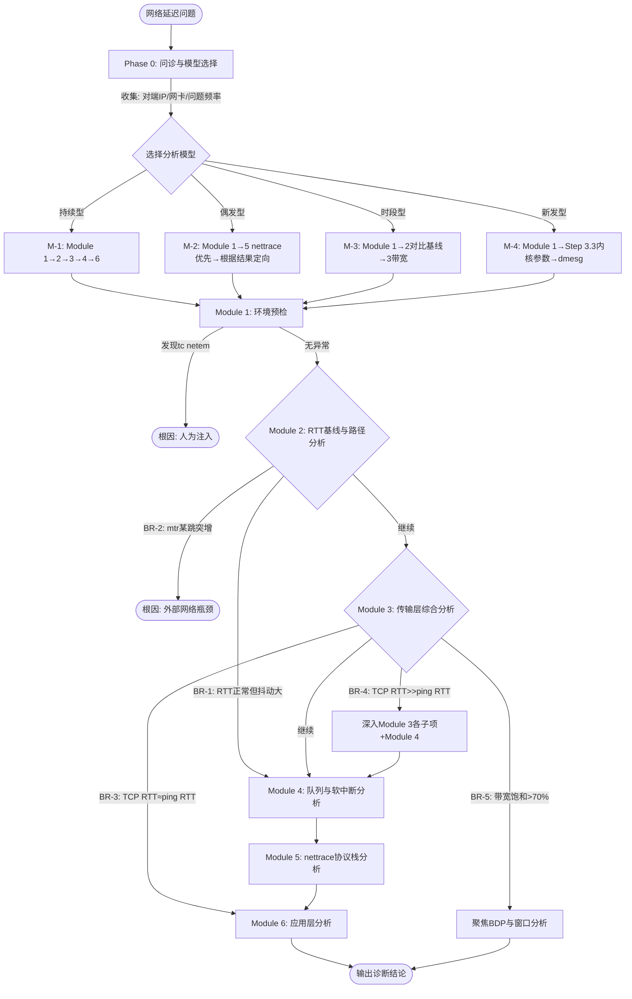

# 延迟排查 — 常见问题、操作参考、命令速查与流程图

> 本文件是 `latency.md` 的补充参考，包含常见问题解答、操作参考、命令速查表和快速排查流程图。
> 公共阈值请参见 `SKILL.md`，核心诊断流程请参见 `latency.md`。

---

## 常见问题解答

### Q1: ping 延迟正常但应用感觉慢，怎么排查？

ping 测试的是 ICMP 延迟，应用使用的是 TCP/UDP。两者延迟可能不同：

```bash
# 1. 检查 TCP 连接的实际 RTT（参数从诊断上下文获取）
ss -i -t dst <诊断上下文.目标IP> | grep -E "rtt:|cwnd:|retrans:"

# 2. 检查是否有重传导致延迟叠加
cat /proc/net/snmp | grep "^Tcp:" | awk 'NR==2{printf "重传段: %s\n发送段: %s\n重传率: %.4f%%\n", $13, $12, $13/$12*100}'

# 3. 检查 socket 队列是否有积压（参数从诊断上下文获取）
ss -tnp dst <诊断上下文.目标IP>

# 4. 检查应用层处理耗时
strace -e trace=network -T -p <PID> 2>&1 | head -20
```

**判断逻辑**：
- TCP RTT ≈ ping RTT 且无重传 → 应用层处理慢（检查 Recv-Q、strace）
- TCP RTT >> ping RTT → 内核协议栈有额外延迟（队列/softirq/Nagle）
- 有大量重传 → 丢包导致延迟增加（参考丢包排查）

### Q2: 怎么判断延迟是网络问题还是对端问题？

```bash
# 1. mtr 逐跳分析，看延迟在哪一跳突增（参数从诊断上下文获取）
mtr -r -c 50 -n <诊断上下文.目标IP>

# 2. 测试到同网段其他主机的延迟做对比
ping -c 20 <同网段其他IP>
```

**判断逻辑**：
- 中间某一跳延迟突增且后续所有跳都高 → 该跳网络设备或链路问题
- 只有最后一跳延迟高 → 对端主机问题（CPU 负载高、应用处理慢）
- 到同网段所有主机都延迟高 → 本机出口或交换机问题
- 到同网段其他主机正常，只有目标慢 → 目标主机自身问题

### Q3: 传输速度慢但延迟不高，怎么排查？

延迟正常但吞吐低，通常是窗口或带宽问题：

```bash
# 1. 检查 TCP 窗口和拥塞窗口（参数从诊断上下文获取）
ss -i -t dst <诊断上下文.目标IP> | grep -E "cwnd:|rcv_space:|send |delivery_rate"

# 2. 检查 TCP 缓冲区配置
sysctl net.ipv4.tcp_rmem
sysctl net.ipv4.tcp_wmem

# 3. 检查窗口缩放是否开启
sysctl net.ipv4.tcp_window_scaling

# 4. 计算 BDP 需求
# BDP = 带宽(bps) × RTT(s)
# 例如 1Gbps × 20ms = 2.5MB，tcp_rmem max 至少要 >= 2.5MB
```

**判断逻辑**：
- `cwnd` 很小（< 10）→ 可能是丢包触发拥塞控制
- `tcp_rmem` / `tcp_wmem` max 值 < BDP → 缓冲区太小
- `tcp_window_scaling` 为 0 → 窗口最大 64KB

### Q4: 网络抖动（延迟不稳定）怎么排查？

```bash
# 1. 长时间 ping 统计抖动（参数从诊断上下文获取）
ping -c 200 -i 0.1 <诊断上下文.目标IP> | tail -5
# 关注 mdev 值（标准差），mdev/avg > 10% 告警，> 30% 严重

# 2. mtr 查看各跳的 StDev（参数从诊断上下文获取）
mtr -r -c 100 -n <诊断上下文.目标IP>

# 3. 检查本机是否有软中断/CPU 导致的抖动
mpstat -P ALL 1 5 2>/dev/null | grep -v "^$"
cat /proc/net/softnet_stat

# 4. 检查中断合并设置（中断合并波动可导致延迟抖动）（参数从诊断上下文获取）
ethtool -c <诊断上下文.网卡> 2>/dev/null

# 5. 检查 qdisc 队列是否有积压波动（参数从诊断上下文获取）
tc -s qdisc show dev <诊断上下文.网卡> 2>/dev/null
```

**常见抖动原因**：
- 中断合并自适应模式（adaptive-rx on）：动态调整聚合周期导致延迟波动
- softirq 调度不均：某核 %soft 高导致处理延迟不稳定
- 网络链路拥塞（某些时段流量大）：mtr 中特定跳 StDev 大
- qdisc 流量整形导致：tc 统计中 `overlimits` 持续增长
- VPN/隧道封装导致：对比 VPN 内外延迟

### Q5: 怎么确认是拥塞导致的延迟？

```bash
# 1. 检查 TCP 拥塞状态
ss -i -t state established | grep -E "cwnd:|ssthresh:|retrans:" | head -10

# 2. 查看拥塞窗口变化趋势（多次采样）（参数从诊断上下文获取）
for i in $(seq 1 5); do
    echo "=== 采样 $i ==="
    ss -i -t dst <诊断上下文.目标IP> 2>/dev/null | grep -E "cwnd:|rtt:" | head -3
    sleep 2
done
```

**判断逻辑**：
- `cwnd` 很小且 `ssthresh` 也小 → 拥塞恢复中
- `cwnd` 反复波动（大→小→大）→ 周期性丢包导致拥塞窗口振荡
- `rtt` 远大于基线 ping 值 → 排队导致延迟增加（bufferbloat 现象）

### Q6: 首次连接慢但后续正常，是什么原因？

首次连接慢的常见原因是 ARP 解析和 TCP 慢启动：

```bash
# 1. 检查 ARP 缓存状态（参数从诊断上下文获取）
ip neigh show | grep <诊断上下文.目标IP>

# 2. 抓包确认首次连接的延迟分布（参数从诊断上下文获取）
sudo timeout 10 tcpdump -i <诊断上下文.网卡> -nn host <诊断上下文.目标IP> -c 20

# 3. 检查 DNS 解析延迟（如果使用域名）
time nslookup <目标域名> 2>/dev/null
```

**判断逻辑**：
- ARP 缓存中目标为 `STALE` 或无条目 → ARP 解析增加了 1 个 RTT
- TCP SYN 后有明显等待 → 可能是对端 SYN 队列满或防火墙规则
- DNS 解析耗时高 → DNS 服务器响应慢

---

## 操作参考（仅供用户手动执行）

> 🛑 **以下命令涉及系统配置变更或带宽消耗，AI 不会自动执行！**
>
> 请用户根据诊断结果，自行判断是否需要执行以下操作。

### 1. iperf3 端到端带宽测试

```bash
# 在目标端启动 iperf3 服务端
iperf3 -s

# 在本端执行测试（默认 TCP，持续 10 秒）
iperf3 -c <目标IP> -t 10

# UDP 测试（指定带宽上限）
iperf3 -c <目标IP> -u -b 1G -t 10

# 反向测试（测试下载方向）
iperf3 -c <目标IP> -R -t 10

# 注意：iperf3 会占用带宽，在生产环境谨慎使用
```

### 2. 修改 TCP 拥塞算法

```bash
# 查看当前拥塞算法
sysctl net.ipv4.tcp_congestion_control

# 切换到 BBR（适合高延迟高丢包链路，需配合 fq qdisc）
sysctl -w net.ipv4.tcp_congestion_control=bbr
tc qdisc replace dev <网卡> root fq

# 永久生效
echo "net.ipv4.tcp_congestion_control = bbr" >> /etc/sysctl.conf
sysctl -p
```

### 3. 调整 TCP 缓冲区

```bash
# 增大 TCP 接收缓冲区（min/default/max，单位字节）
sysctl -w net.ipv4.tcp_rmem="4096 131072 16777216"

# 增大 TCP 发送缓冲区
sysctl -w net.ipv4.tcp_wmem="4096 65536 16777216"

# 增大全局 socket 缓冲区上限
sysctl -w net.core.rmem_max=16777216
sysctl -w net.core.wmem_max=16777216

# 关闭空闲后慢启动重启（长连接间歇传输场景）
sysctl -w net.ipv4.tcp_slow_start_after_idle=0
```

### 4. 修改 qdisc 队列配置

```bash
# 替换为 fq（公平队列，配合 BBR 使用支持 TCP Pacing）
tc qdisc replace dev <网卡> root fq

# 替换为 fq_codel（减少 bufferbloat）
tc qdisc replace dev <网卡> root fq_codel

# 调整 txqueuelen
ip link set <网卡> txqueuelen 10000
```

### 5. 调整中断合并参数

```bash
# 查看当前中断合并设置
ethtool -c <网卡> 2>/dev/null

# 降低中断合并延迟（减少延迟，但增加 CPU 开销）
ethtool -C <网卡> rx-usecs 10 tx-usecs 10

# 或关闭自适应中断合并（固定为低延迟模式）
ethtool -C <网卡> adaptive-rx off adaptive-tx off
```

### 6. 调整 softirq 预算

```bash
# 增大 softirq 每次处理的包数上限（减少 ksoftirqd 降级）
sysctl -w net.core.netdev_budget=600

# 增大 softirq 处理时间上限（微秒）
sysctl -w net.core.netdev_budget_usecs=4000

# 增大 netdev backlog 队列（减少队列溢出丢包）
sysctl -w net.core.netdev_max_backlog=2000
```

### 7. 调整 ARP 表大小

```bash
# 增大 ARP 表上限（大规模组网场景）
sysctl -w net.ipv4.neigh.default.gc_thresh1=4096
sysctl -w net.ipv4.neigh.default.gc_thresh2=8192
sysctl -w net.ipv4.neigh.default.gc_thresh3=16384
```

---

## 命令速查表

| 场景 | 命令 |
|------|------|
| 基础延迟测试 | `ping -c 100 -i 0.1 <目标IP>` |
| 逐跳延迟分析 | `mtr -r -c 50 -n <目标IP>` |
| TCP 模式逐跳 | `mtr -r -c 50 -n -T -P 443 <目标IP>` |
| TCP 连接详细信息 | `ss -i -t dst <目标IP>` |
| 查看拥塞窗口/Pacing | `ss -i -t \| grep -E "cwnd\|pacing_rate"` |
| 查看拥塞算法 | `sysctl net.ipv4.tcp_congestion_control` |
| TCP 缓冲区配置 | `sysctl net.ipv4.tcp_rmem` |
| TCP 重传统计 | `cat /proc/net/snmp \| grep "^Tcp:"` |
| 网卡速率确认 | `ethtool <网卡> \| grep Speed` |
| **中断合并设置** | **`ethtool -c <网卡>`** |
| 实时流量监控 | `sar -n DEV 1 5` |
| qdisc 队列统计 | `tc -s qdisc show dev <网卡>` |
| **softirq 统计** | **`cat /proc/net/softnet_stat`** |
| **softirq 预算** | **`sysctl net.core.netdev_budget`** |
| **CPU 软中断分布** | **`mpstat -P ALL 1 3`** |
| **GRO 状态** | **`ethtool -k <网卡> \| grep gro`** |
| **ARP 缓存状态** | **`ip neigh show`** |
| socket 队列积压 | `ss -tnp \| awk 'NR>1 {if($2>0 \|\| $3>0) print}'` |
| **nettrace 协议栈延迟** | **`timeout <N> nettrace -p tcp --latency-show --daddr <IP>`** |
| **nettrace 延迟过滤** | **`timeout <N> nettrace -p tcp --min-latency 1000 --daddr <IP>`** |
| **nettrace 延迟分布** | **`timeout <N> nettrace -p tcp --latency --latency-summary`** |
| **nettrace RTT 分布** | **`timeout <N> nettrace --rtt`** |
| **nettrace RTT 详情** | **`timeout <N> nettrace --rtt-detail --filter-srtt 10`** |
| 带宽测试 | `iperf3 -c <目标IP> -t 10`（⚠️ 占带宽） |

---

## 快速排查流程图

### Mermaid 版本



### 文字版本

```
网络延迟高？
│
├── Phase 0: 问诊与模型选择
│   ├── 收集: 对端IP、网卡/bond、问题频率、业务协议
│   ├── 生成: 诊断上下文摘要
│   └── 选择分析模型 →
│         ├── M-1(持续型) → Module 1 → Module 2 → Module 3 → Module 4 → Module 6
│         ├── M-2(偶发型) → Module 1 → Module 5(nettrace优先) → 根据结果定向
│         ├── M-3(时段型) → Module 1 → Module 2(对比基线) → Module 3(带宽)
│         └── M-4(新发型) → Module 1 → Step 3.3(内核参数) → dmesg分析
│
├── Module 1: 环境预检
│   ├── 发现 tc netem → 输出根因（人为注入），结束
│   ├── IOMMU 开启 → 记录为潜在延迟因素
│   └── 无异常 → 按模型推荐路径继续
│
├── Module 2: RTT 基线与路径分析
│   ├── 🔀 BR-1: RTT 正常但抖动大(mdev/avg>20%) → Module 4 队列/softirq分析
│   ├── 🔀 BR-2: mtr 某跳突增 > 前一跳 2 倍 → 标记外部瓶颈，结束
│   └── 继续 → Module 3
│
├── Module 3: 传输层综合分析
│   ├── Step 3.1: 带宽/NIC/中断合并
│   │   ├── 中断合并 rx-usecs > 250μs → 延迟敏感场景考虑降低
│   │   └── 🔀 BR-5: 带宽利用率 > 70% → 聚焦 BDP/窗口分析
│   ├── Step 3.2: 拥塞控制/Pacing
│   │   ├── BBR + 非fq qdisc → Pacing 不工作，建议切换 qdisc
│   │   ├── 🔀 BR-3: TCP RTT ≈ ping RTT(差<15%) → Module 6 应用层
│   │   └── 🔀 BR-4: TCP RTT >> ping RTT(差>50%) → 深入各子项+Module 4
│   └── Step 3.3: 内核参数/Nagle/缓冲区
│       ├── tcp_wmem max < BDP → 缓冲区不足
│       ├── Nagle + Delayed ACK 叠加 → 小包延迟高
│       └── tcp_slow_start_after_idle=1 → 间歇传输延迟高
│
├── Module 4: 队列与软中断分析
│   ├── Step 4.1: Qdisc 排队
│   │   └── backlog 持续非零 → 排队延迟
│   ├── Step 4.2: softirq/ksoftirqd
│   │   ├── time_squeeze 增长 → softirq 处理积压
│   │   └── ksoftirqd CPU 高 → 已降级为线程处理
│   ├── Step 4.3: GRO/IP 分片
│   │   └── ReasmFails 增长 → 分片重组失败
│   └── Step 4.4: ARP 解析
│       └── STALE/FAILED 条目多 → 首包延迟高
│
├── Module 5: nettrace 协议栈分析（可在任意步骤后使用）
│   ├── Step 5.1: --latency-show → 各环节延迟分布
│   │   └── 某环节延迟高 → 定位到具体内核函数
│   ├── Step 5.2: --latency-summary → 延迟分布统计
│   │   └── 延迟分布偏高 → 协议栈处理瓶颈
│   └── --rtt → RTT 分布异常
│       └── RTT 高值比例大 → 网络延迟或拥塞
│
└── Module 6: 应用层分析
    ├── Step 6.1: Socket Backlog
    │   ├── Recv-Q > 0 → 应用 recv() 太慢
    │   └── Send-Q > 0 → 网络拥塞或对端窗口小
    ├── Step 6.2: 进程调度
    │   └── CPU 负载高 + 应用延迟高 → 调度排队
    └── Step 6.3: 系统调用
        ├── sendto 耗时高 → 发送缓冲区满
        ├── recvfrom 耗时高 → 等待数据
        └── connect 耗时高 → 握手延迟
```
