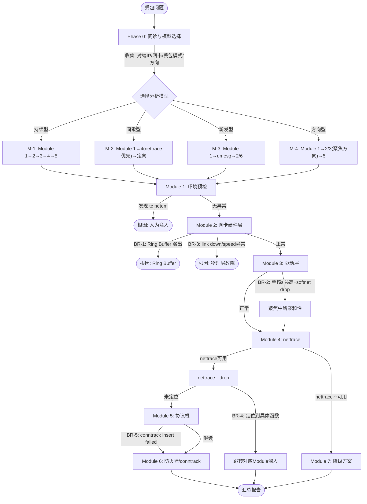

# 丢包排查

> 本文件包含网络丢包的完整诊断流程。公共部分（安全原则、前置检查、阈值表）请参见 SKILL.md。
>
> 排查思路：问诊定向 → 环境预检 → 网卡硬件层 → 网卡驱动层 → nettrace 智能诊断 → 协议栈层 → 防火墙/连接跟踪 → 降级方案

---

## Phase 0: 问诊与分析模型选择

> **⚠️ 必须在执行任何诊断命令之前完成此阶段。** AI 需要通过结构化问诊收集关键上下文，然后根据问诊结果选择最匹配的分析模型，确定诊断路径。

### 必要信息清单

| 编号 | 信息项 | 说明 | 获取策略 |
|------|-------|------|---------|
| Q1 | **对端 IP / 域名** | 丢包的目标地址 | 用户未提供则**必须询问**；影响 ping/mtr/nettrace/tcpdump 目标参数 |
| Q2 | **网卡 / bond 名称** | 流量出口接口 | 通过 `ip route get <对端IP>` 自动推断；单网卡场景直接使用，多网卡/bond 场景向用户确认 |
| Q3 | **丢包模式** | 持续 / 间歇 / 新发 / 特定方向 | 用户未明确则**必须询问**；直接决定分析模型选择 |
| Q4 | **丢包方向** | 发送丢包 / 接收丢包 / 双向 | 可通过 `ethtool -S` 的 rx/tx 计数辅助判断 |
| Q5 | **业务协议与端口** | TCP/UDP？端口号？ | 用户提到具体业务时追问；用于 nettrace/tcpdump 过滤 |
| Q6 | **已做过的排查** | 用户已尝试的操作 | 可选，避免重复劳动 |

### 智能问诊规则

```
WHEN 用户 prompt 中已包含对端 IP:
  → 跳过 Q1，直接使用

WHEN `ip route get` 推断结果明确（单一出口网卡，非 bond/非多 NIC）:
  → Q2 直接使用推断结果，无需确认，在诊断上下文摘要中展示
WHEN `ip route get` 推断结果涉及 bond/多网卡/结果不明确:
  → Q2 向用户确认

WHEN 用户 prompt 中提到 "一直丢"/"持续丢包"/"稳定丢包":
  → Q3 已知 = 持续，跳过 Q3

WHEN 用户 prompt 中提到 "偶尔丢"/"间歇"/"时有时无":
  → Q3 已知 = 间歇，跳过 Q3

WHEN 用户 prompt 中提到 "刚开始"/"升级后"/"配置后":
  → Q3 已知 = 新发，跳过 Q3

WHEN 用户 prompt 中提到 "rx drop"/"接收丢包":
  → Q4 已知 = 接收方向，跳过 Q4

WHEN 用户 prompt 中提到 "tx drop"/"发送丢包":
  → Q4 已知 = 发送方向，跳过 Q4

WHEN 用户提到了具体业务（如 "SSH 连接断"/"MySQL 超时"）:
  → 追问 Q5（端口），并自动推断协议

WHEN 缺失的必要信息 ≤ 2 项:
  → 合并为一次提问

WHEN 缺失的必要信息 > 2 项:
  → 分两次提问，先问最关键的 Q1 + Q3
```

### 分析模型（M-1 ~ M-4）

根据问诊收集到的**丢包模式**（核心分类维度），选择分析模型：

| 模型编号 | 丢包模式 | 分析策略 | 核心工具 | 推荐路径 |
|---------|---------|---------|---------|---------|
| **M-1: 持续型丢包** | 丢包率稳定、必现 | 逐层排查 → 缩小范围 | ethtool/ip/netstat/nettrace | Module 1 → Module 2 → Module 3 → Module 4 → Module 5 |
| **M-2: 间歇型丢包** | 丢包偶发、不易复现 | 抓现场 → 关联时间点 | nettrace --drop + 监控脚本 | Module 1 → **Module 4（nettrace 优先）** → 根据结果定向 |
| **M-3: 新发型丢包** | 变更/升级后出现 | 变更溯源 → 差异对比 | dmesg/ethtool/sysctl diff | Module 1 → dmesg → Module 2(硬件变更) → Module 6(规则变更) |
| **M-4: 方向型丢包** | 仅某方向丢包 | 聚焦 rx 或 tx 路径 | ethtool -S rx/tx 分项 | Module 1 → Module 2/3(聚焦对应方向) → Module 5 |

**模型选择逻辑**：

```
IF 丢包模式 == "持续":
  → 选择 M-1，按标准逐层排查路径
  → 推荐路径: Module 1 → Module 2 → Module 3 → Module 4 → Module 5

IF 丢包模式 == "间歇":
  → 选择 M-2，提示用户："间歇型丢包最有效的方式是抓现场，建议优先使用 nettrace --drop 实时监控"
  → 推荐路径: Module 1 → Module 4(nettrace 优先) → 根据结果定向

IF 丢包模式 == "新发" AND (用户提到升级/配置变更/新部署):
  → 选择 M-3，优先检查变更内容
  → 推荐路径: Module 1 → dmesg/journal → Module 2(硬件) → Module 6(规则)

IF Q4 明确了方向（仅 rx 或仅 tx）:
  → 选择 M-4，聚焦单方向排查
  → 推荐路径: Module 1 → Module 2(聚焦方向) → Module 3(聚焦方向) → Module 5
```

### 诊断上下文摘要

问诊结束后，AI 内部生成诊断上下文摘要，**后续所有 Module 的命令参数从此摘要中取值**：

```markdown
> **📋 诊断上下文（丢包）**
> - 目标: <对端IP> (<协议>:<端口>)
> - 出口网卡: <网卡名> (via `ip route get` 推断)
> - 丢包模式: <持续/间歇/新发/方向型>，<补充描述>
> - 丢包方向: <接收/发送/双向>
> - 业务: <业务类型>
> - 分析模型: <M-1/M-2/M-3/M-4>
```

**命令参数绑定规则**（替代硬编码 eth0/8.8.8.8）：

```
所有 ping 命令:       ping -c N <诊断上下文.目标IP>
所有 mtr 命令:        mtr -rwzbc N <诊断上下文.目标IP>
所有 ethtool:         ethtool <诊断上下文.网卡>
所有 ethtool -S:      ethtool -S <诊断上下文.网卡>
所有 tcpdump:         tcpdump -i <诊断上下文.网卡> host <诊断上下文.目标IP>
所有 nettrace:        nettrace --daddr <诊断上下文.目标IP> [--dport <端口>]
所有 ip -s link:      ip -s link show dev <诊断上下文.网卡>
所有 tc:              tc -s qdisc show dev <诊断上下文.网卡>
```

---

## 症状速查表

> 根据典型症状快速选择分析模型和起始 Module，避免盲目全流程执行。

| 症状特征 | 分析模型 | 推荐起始 Module | 关键命令 |
|---------|----------|----------------|---------|
| 丢包率稳定，ping 持续丢 | M-1 持续型 | Module 1 → Module 2 | `ping -c 100`, `ethtool -S` |
| 偶尔丢几个包，不规律 | M-2 间歇型 | Module 1 → Module 4 | `nettrace --drop` |
| ethtool -S 显示 rx_dropped 持续增长 | M-1 持续型 | Module 2 | `ethtool -S`, `ethtool -g` |
| ifconfig 显示 RX errors/overruns 增加 | M-1 持续型 | Module 2 → Module 3 | `ip -s link`, `ethtool -S` |
| 单核 si% 很高，softnet_stat 有丢包 | M-1 持续型 | Module 3 | `mpstat -P ALL`, `cat /proc/net/softnet_stat` |
| 升级内核/变更配置后开始丢包 | M-3 新发型 | Module 1 → dmesg | `dmesg -T`, `sysctl -a \| diff` |
| netstat -s 显示 TCP 重传/丢弃增加 | M-1 持续型 | Module 5 | `netstat -s`, `ss -s` |
| conntrack 表满，新连接被拒绝 | M-1 持续型 | Module 6 | `conntrack -C`, `dmesg \| grep conntrack` |
| 仅接收方向丢包，发送正常 | M-4 方向型 | Module 2(rx) → Module 3 | `ethtool -S` (rx 字段) |
| nettrace --drop 有大量输出 | M-2 间歇型 | Module 4 | `nettrace --drop` |

---

## 诊断流程图

### Mermaid 版本



### 文字版本

```
发现丢包？
│
├── Phase 0: 问诊与模型选择
│   ├── 收集: 对端IP、网卡/bond、丢包模式、丢包方向
│   ├── 生成: 诊断上下文摘要
│   └── 选择分析模型 →
│         ├── M-1(持续型) → Module 1 → Module 2 → Module 3 → Module 4 → Module 5
│         ├── M-2(间歇型) → Module 1 → Module 4(nettrace优先) → 根据结果定向
│         ├── M-3(新发型) → Module 1 → dmesg → Module 2/6(变更相关)
│         └── M-4(方向型) → Module 1 → Module 2/3(聚焦方向) → Module 5
│
├── Module 1: 环境预检与基本信息
│   ├── 发现 tc netem 规则 → 输出根因（人为注入），结束
│   └── 无异常 → 按模型路径继续
│
├── Module 2: 网卡硬件层检查
│   ├── 🔀 BR-1: Ring Buffer drop 持续增长 → 输出根因 + 调优建议，结束
│   ├── 🔀 BR-3: link down / speed 异常 → 输出根因（物理层），结束
│   └── 正常 → 继续
│
├── Module 3: 网卡驱动层检查
│   ├── 🔀 BR-2: 单核 si% 高 + softnet drop → 聚焦中断亲和性
│   └── 正常 → 继续
│
├── Module 4: nettrace 智能诊断
│   ├── nettrace 可用 → nettrace --drop 定位
│   │   ├── 🔀 BR-4: 定位到具体函数 → 跳转对应 Module 深入分析
│   │   └── 未定位 → 继续 Module 5
│   └── nettrace 不可用 → Module 7(降级方案)
│
├── Module 5: 协议栈层丢包分析
│   ├── 🔀 BR-5: conntrack insert failed → Module 6
│   └── 继续 → Module 6
│
├── Module 6: 防火墙与连接跟踪
│   └── 结束 → 汇总报告
│
└── Module 7: 降级方案（仅 nettrace 不可用时）
    └── perf/dropwatch/tcpdump 追踪
```

---

## 诊断步骤

以下命令可由 AI 自动执行，用于诊断丢包问题。所有命令中的目标 IP、网卡名等参数**从 Phase 0 的诊断上下文中取值**，不使用硬编码默认值。

### Module 1: 环境预检与基本信息

> 本模块排除人为流量控制注入，并收集系统基本信息和丢包现象确认。

#### Step 1.1: 排除人为流量控制（tc netem）

> **⚠️ 必须首先执行此步骤**：在深入排查之前，先确认是否存在通过 `tc netem` 人为注入的丢包/延迟。这是最常见的误判陷阱——netem 注入的丢包会被误判为网络链路或协议栈问题。

```bash
# 查看所有设备上的 qdisc（包括 ifb、veth 等虚拟设备）
tc -s qdisc show 2>/dev/null | grep -v "noqueue"

# 检查是否加载了 ifb/netem 内核模块
lsmod | grep -E "ifb|sch_netem" 2>/dev/null

# 检查出口网卡上是否有 ingress qdisc + filter 重定向（参数从诊断上下文获取）
tc qdisc show dev <诊断上下文.网卡> ingress 2>/dev/null
tc filter show dev <诊断上下文.网卡> parent ffff: 2>/dev/null
```

**判断规则**：
- `tc -s qdisc show` 输出中**任何设备**上出现 `qdisc netem`（含 `loss`、`delay`、`duplicate`、`corrupt` 等参数） → **丢包/延迟是人为注入的**
- `lsmod | grep ifb` 有输出 → ifb 设备被加载，通常配合 netem 用于 ingress 方向注入
- `lsmod | grep sch_netem` 有输出 → netem 模块已加载
- `tc filter show ... parent ffff:` 有 `mirred egress redirect dev ifb0` → 出口网卡入站流量被重定向到 ifb0 处理

**如果发现 netem 规则**：
1. **直接报告**：指出具体的 netem 参数（loss/delay/jitter 等），明确说明这是人为注入而非真实网络问题
2. **给出清除命令**（仅作参考，由用户决定是否执行）：
   ```bash
   tc qdisc del dev ifb0 root 2>/dev/null
   tc qdisc del dev <诊断上下文.网卡> handle ffff: ingress 2>/dev/null
   ip link set dev ifb0 down 2>/dev/null
   ```
3. **如果用户确认需要排查真实网络问题**：清除 netem 后再从 Step 1.2 开始重新诊断

**如果未发现 netem 规则** → 继续执行 Step 1.2。

#### Step 1.2: 确认系统基本信息与丢包现象

```bash
# 确认系统和内核版本
uname -r
cat /etc/os-release | grep -E "^NAME=|^VERSION="

# 查看所有网络接口概况
ip -brief link show
ip -brief addr show

# 快速确认是否有丢包（查看接口错误统计）（参数从诊断上下文获取）
ip -s link show dev <诊断上下文.网卡> | head -20

# 查看网卡驱动信息（参数从诊断上下文获取）
ethtool -i <诊断上下文.网卡> 2>/dev/null | grep -E "driver|version|firmware"
```

**输出解读**：
- 确认目标网卡名称与诊断上下文一致
- `ip -s link` 中 RX 行的 errors/dropped/overrun 如果非零，说明有丢包发生
- 记录网卡驱动和固件版本，用于后续与 TencentOS 版本差异表对照

---

### Module 2: 网卡硬件层检查

> 本模块检查网卡硬件层的丢包问题，包括 Ring Buffer 溢出和协商异常。

#### Step 2.1: Ring Buffer 溢出检查

```bash
# 查看 Ring Buffer 溢出丢包计数（参数从诊断上下文获取）
ethtool -S <诊断上下文.网卡> 2>/dev/null | grep -i rx_fifo

# 查看当前 Ring Buffer 大小和最大值（参数从诊断上下文获取）
ethtool -g <诊断上下文.网卡> 2>/dev/null
```

**判断规则**：
- `rx_fifo_errors` 非零：Ring Buffer 缓冲区满导致丢包，网卡来不及将数据包搬到内存
- `ethtool -g` 输出中 `Pre-set maximums` 是硬件支持的最大值，`Current hardware settings` 是当前值
- 如果当前 RX 远小于最大值（如当前 256 而最大支持 4096），可以考虑增大

> **🔀 智能分支 BR-1**: 如果 `rx_fifo_errors` 非零且持续增长，这是 Ring Buffer 溢出的明确根因。建议直接给出根因和调优建议（增大 Ring Buffer），跳过后续 Module。
> **原因**: Ring Buffer 溢出是硬件层丢包的确定根因，无需继续排查软件层。

#### Step 2.2: 协商状态与硬件错误检查

```bash
# 查看网卡协商速率、双工模式和链路状态（参数从诊断上下文获取）
ethtool <诊断上下文.网卡> 2>/dev/null | grep -E "Speed|Duplex|Auto-negotiation|Link detected"

# 查看网卡所有错误计数（非零项）（参数从诊断上下文获取）
ethtool -S <诊断上下文.网卡> 2>/dev/null | grep -iE "error|drop|miss|bad|crc|length" | grep -v ": 0$"

# 查看网卡流控配置和统计（参数从诊断上下文获取）
ethtool -a <诊断上下文.网卡> 2>/dev/null
ethtool -S <诊断上下文.网卡> 2>/dev/null | grep -i control

# 查看网卡硬件 EEPROM 信息（光模块诊断）（参数从诊断上下文获取）
ethtool -m <诊断上下文.网卡> 2>/dev/null | head -30
```

**输出解读**：

**协商状态**：
- `Speed: 10000Mb/s` + `Duplex: Full`：万兆全双工，正常
- `Speed: 100Mb/s`：只协商到百兆，可能网线或对端设备问题
- `Duplex: Half`：半双工，会导致严重性能问题和丢包
- `Auto-negotiation: on`：自协商开启
- `Link detected: no`：物理链路未连接

**硬件错误**：
- `rx_crc_errors` 非零：CRC 校验失败，通常是网线质量差、水晶头接触不良或交换机端口故障
- `rx_long_length_errors` / `rx_short_length_errors` 非零：报文长度异常，可能 MTU 配置不匹配
- `rx_flow_control_xon` / `rx_flow_control_xoff`：流控 pause 帧计数，说明网卡 RX Buffer 资源受限触发了流控

**光模块诊断**：
- 如果 `ethtool -m` 输出中有告警标识为 `on`（如 `Rx power low alarm`），说明收光信号弱，需检查光模块或光纤

> **🔀 智能分支 BR-3**: 如果 `Link detected: no` 或 Speed/Duplex 严重异常（如协商到半双工），这是物理层故障的明确根因。建议直接报告物理层问题，**停止后续诊断**。
> **原因**: 物理链路异常时，协议栈层面的分析没有意义。

---

### Module 3: 网卡驱动层检查

> 本模块检查网卡驱动层的丢包问题，包括接口错误计数、softnet backlog 溢出和中断分布。

#### Step 3.1: 接口错误计数分析

```bash
# 使用 ip 命令查看详细的接口统计（参数从诊断上下文获取）
ip -s -d link show <诊断上下文.网卡>
```

**输出解读**：

**RX（接收方向）**：
- `rx errors`：总的收包错误数量，是以下各类错误的汇总
- `rx dropped`：数据包已进入 Ring Buffer，但因内存不足等原因在拷贝到内存过程中被丢弃。可能原因：
  - softnet backlog 满（最常见，在 `/proc/net/softnet_stat` 第二列有统计）
  - Bad/Unintended VLAN tags
  - Unknown/Unregistered protocols
- `rx overrun`：数据包未到达 Ring Buffer 就被网卡物理层丢弃，驱动处理速度跟不上网卡收包速度，与 `rx_fifo_errors` 是同一问题
- `rx frame`：misaligned frames，通常需要检查物理层面问题（网线、交换机接口、光模块信号）

**TX（发送方向）**：
- `tx errors`：发送错误，可能包括 aborted transmission、carrier errors、fifo errors、heartbeat errors、window errors
- `collsns`：由于 CSMA/CD 造成的传输冲突中断（半双工环境下才常见）
- TX 方向出现问题的概率较 RX 小

#### Step 3.2: softnet backlog 溢出检查

```bash
# 查看 softnet_stat（每行对应一个 CPU）
cat /proc/net/softnet_stat

# 查看当前 netdev_max_backlog 值
sysctl net.core.netdev_max_backlog

# 查看当前 netdev_budget 值
sysctl net.core.netdev_budget
```

**输出解读**：

`/proc/net/softnet_stat` 每行代表一个 CPU 的统计，每列含义：
- **第一列**：该 CPU 处理的数据包总数
- **第二列**：因 `netdev_max_backlog` 队列溢出而被丢弃的数据包数量。**如果非零，说明存在驱动层丢包**
- **第三列**：soft IRQ 获取 CPU 时间不足，来不及处理足够多的数据包次数（`time_squeeze`）。**如果持续增加，需要增大 `netdev_budget`**

`netdev_max_backlog`：内核从网卡收到数据包后，交给上层协议栈处理之前的缓冲队列长度。每个 CPU 都有一个独立的 backlog 队列，当收包速率大于协议栈处理速率时，队列会溢出丢包。逻辑位于内核 `net/core/dev.c` 的 `enqueue_to_backlog` 函数。

`netdev_budget`：控制 NAPI poll 函数中单次循环读取数据包的最大数量，影响软中断每次处理的数据包批量。

#### Step 3.3: 中断分布与单核负载检查

```bash
# 查看各 CPU 软中断利用率
mpstat -P ALL 1 3 2>/dev/null || cat /proc/stat | head -20

# 查看网卡中断在各 CPU 上的分布（参数从诊断上下文获取）
grep <诊断上下文.网卡> /proc/interrupts 2>/dev/null | head -20

# 查看网卡队列数（参数从诊断上下文获取）
ethtool -l <诊断上下文.网卡> 2>/dev/null

# 查看 irqbalance 服务状态
systemctl is-active irqbalance 2>/dev/null

# 查看网卡中断亲和性设置脚本（TencentOS 特有）
ls /usr/local/bin/*irq* /usr/local/sbin/*irq* 2>/dev/null
ls /etc/sysconfig/irqbalance 2>/dev/null && cat /etc/sysconfig/irqbalance
```

**判断规则**：
- `mpstat` 中 `%soft` 列：软中断占用率。如果某个 CPU 的 `%soft` 持续 > 50%，说明单核软中断负载过高，可能导致丢包
- `/proc/interrupts`：正常情况下网卡中断应均匀分布在各 CPU 上。如果集中在某个核上，说明中断亲和性配置有问题
- `ethtool -l`：网卡队列数决定了可并行处理的 CPU 数量，队列数太少会导致中断集中
- TencentOS 上通常有专门的网卡中断亲和性设置脚本，确认是否生效

> **🔀 智能分支 BR-2**: 如果 `softnet_stat` 第 2 列 > 0 且 `mpstat` 显示单核 si% > 80%，说明软中断集中在单核导致处理不过来。建议聚焦本 Module 的中断亲和性子步骤（检查 RSS/RPS/irqbalance 配置）。
> **原因**: 中断亲和性不均是单核过载丢包的根因，需要调整中断分布而非增大 backlog。

---

### Module 4: nettrace 智能诊断

> 本模块使用 nettrace 进行丢包诊断。nettrace 是基于 eBPF 的集网络报文跟踪、网络故障诊断、网络异常监控于一体的网络工具集。详细的工具介绍、能力对比参见 `references/nettrace.md`。
>
> **nettrace 是丢包路径跟踪和网络故障诊断的首选工具。** 对于 M-2（间歇型丢包），建议在 Module 1 之后直接进入本模块。

#### Step 4.1: nettrace 安装与就绪检查

> **严格要求**：必须按照以下完整流程执行，**禁止在未尝试安装 nettrace 的情况下直接跳过**。

```bash
which nettrace && nettrace -V
```

- 如果上述命令**执行成功**（输出了版本号）→ 跳转到 **Step 4.2**
- 如果上述命令**执行失败**（command not found）→ **必须继续尝试安装**

**nettrace 未安装时的处理**：

> 完整的安装流程（包管理器安装、源码编译、BTF 判断、备选安装路径）参见 `references/nettrace.md` 安装章节。

**必须先询问用户确认**是否可以安装 nettrace。

**情况 A：用户同意安装** → 按照 `references/nettrace.md` 安装章节依次执行，每一步都必须检查是否成功：
1. **优先尝试包管理器安装**：TencentOS 2 用 `yum install -y nettrace`，TencentOS 3/4 用 `dnf install -y nettrace`
2. **包管理器失败则源码编译**：`git clone https://gitee.com/OpenCloudOS/nettrace.git`，根据 BTF 支持情况选择编译方式
3. **安装到系统 PATH 并验证**：`which nettrace && nettrace -V`

如果验证成功 → 跳转到 **Step 4.2**。
如果安装过程中某一步实际执行后失败 → 记录失败原因，跳转到 **Module 7（降级方案）**。

**情况 B：用户拒绝安装** → 跳转到 **Module 7（降级方案）**。

#### Step 4.2: 丢包监控（nettrace --drop）

> nettrace 需要 root 权限运行。完整的命令参数说明参见 `references/nettrace.md`。
>
> ⚠️ **AI 执行约束**（详见 `references/nettrace.md` AI 执行约束章节）：
> - **所有流式命令必须用 `timeout <N>` 包裹**（先询问用户监控时长，默认 30 秒）
> - **IP/端口信息**：从诊断上下文获取

```bash
# 监控系统丢包（显示丢包原因）（参数从诊断上下文获取）
sudo timeout <N> nettrace --drop

# 监控丢包并打印内核调用栈
sudo timeout <N> nettrace --drop --drop-stack

# 过滤特定地址/端口的丢包（参数从诊断上下文获取）
sudo timeout <N> nettrace --drop --daddr <诊断上下文.目标IP>
sudo timeout <N> nettrace --drop --port <诊断上下文.端口>
```

**输出解读**：每行显示一个丢包事件，包含协议、源/目的地址端口、丢包原因（reason）和丢包位置（内核函数）。常见丢包原因及完整列表参见 `references/nettrace.md` 丢包监控章节。

> **🔀 智能分支 BR-4**: 如果 `nettrace --drop` 定位到具体的内核丢包函数，根据函数所在子系统跳转到对应 Module 深入分析：
> - 函数在 `net/core/` → Module 5（协议栈层）
> - 函数在 `net/netfilter/` → Module 6（防火墙/conntrack）
> - 函数在驱动相关路径 → Module 3（驱动层）
> **原因**: nettrace 已精确定位丢包点，无需盲目逐层排查。

#### Step 4.3: 网络故障诊断（nettrace --diag）

```bash
# 只显示异常报文（参数从诊断上下文获取）
sudo timeout <N> nettrace --diag --diag-quiet

# 持续诊断 + 只显示异常
sudo timeout <N> nettrace --diag --diag-keep --diag-quiet

# 诊断 + 显示 netfilter 钩子函数（定位防火墙丢包）（参数从诊断上下文获取）
sudo timeout <N> nettrace --diag --saddr <诊断上下文.目标IP> --hooks
```

**输出解读**：诊断模式提供 INFO/WARN/ERROR 三种级别提示，诊断结果（`ANALYSIS RESULT`）会列出所有异常事件并给出 `fix advice`（修复建议）。详细的输出格式和特性说明参见 `references/nettrace.md` 故障诊断模式章节。

#### Step 4.4: 报文生命周期跟踪

```bash
# 跟踪 ICMP 报文的完整内核路径（参数从诊断上下文获取）
sudo timeout <N> nettrace -p icmp --saddr <诊断上下文.目标IP>

# 跟踪 TCP 报文（参数从诊断上下文获取）
sudo timeout <N> nettrace -p tcp --daddr <诊断上下文.目标IP> --dport <诊断上下文.端口>

# 限制跟踪报文个数（会自动退出，无需 timeout）
sudo nettrace -p icmp --saddr <诊断上下文.目标IP> -c 5
```

**输出解读**：每行显示报文经过的内核函数和时间戳。`kfree_skb` 表示报文被丢弃，`consume_skb` 表示正常消费。支持 NAT 场景持续跟踪。更多参数和用法参见 `references/nettrace.md` 报文生命周期跟踪章节。

---

### Module 5: 协议栈层丢包分析

> 本模块分析 IP/TCP/UDP 协议栈层面的丢包统计。conntrack/iptables 相关检查已移至 Module 6。

#### Step 5.1: IP/TCP/UDP 层统计分析

```bash
# 查看协议栈各层统计（综合视图）
netstat -s 2>/dev/null | head -80

# 查看 IP 层统计
cat /proc/net/snmp | grep -E "^Ip:"

# 查看 TCP 层统计（重点关注重传和错误）
cat /proc/net/snmp | grep -E "^Tcp:"

# 查看 UDP 层统计
cat /proc/net/snmp | grep -E "^Udp:"
```

**输出解读**：

**IP 层关键指标**（`/proc/net/snmp` Ip 行）：
- `InDiscards`：IP 层丢弃的入站包数量，非零需关注
- `InDelivers`：成功传递给上层的包数量
- `OutDiscards`：IP 层丢弃的出站包数量
- `ForwDatagrams`：转发的包数量（非路由器应为 0）

**TCP 层关键指标**：
- `RetransSegs`（重传段数）：比较重传次数与总发送次数（`OutSegs`），计算重传率。重传率 > 1% 需要关注（**参见 SKILL.md 公共阈值参考表**）
- `InErrs`（入站错误）：收到的校验和错误的包
- `AttemptFails`（连接建立失败）：SYN 超时或被拒绝
- `EstabResets`（连接被重置）：已建立的连接被 RST

**UDP 层关键指标**：
- `InErrors`：接收错误（通常是 buffer 满）
- `RcvbufErrors`：接收缓冲区不足丢包
- `SndbufErrors`：发送缓冲区不足

#### Step 5.2: 扩展 TCP 统计与丢包统计

```bash
# 查看扩展 TCP 统计
cat /proc/net/netstat | grep -E "^TcpExt:"

# 查看专用丢包统计接口（如果存在）
cat /proc/net/dropstat 2>/dev/null

# 查看 ARP 缓存相关丢包统计
cat /proc/net/stat/arp_cache 2>/dev/null | head -5
```

**输出解读**：

**TCP 扩展指标**（`/proc/net/netstat` TcpExt 行）：
- `TCPLostRetransmit`：因丢包而重传
- `TCPSynRetrans`：SYN 包重传次数
- `TCPTimeouts`：TCP 超时次数
- `ListenOverflows` / `ListenDrops`：监听队列溢出/丢弃（accept queue 满）
- `TCPBacklogDrop`：socket backlog 队列满导致丢包
- `TCPReqQFullDrop`：请求队列满丢弃

**dropstat**：
- 如果 `/proc/net/dropstat` 存在，直接显示各种内核丢包原因的计数
- 不清楚某个计数含义时，可在内核源码中搜索对应的 `LINUX_MIB_*` 宏定义来确认

> **🔀 智能分支 BR-5**: 如果 `netstat -s` 显示 `conntrack insert failed > 0` 或 `nf_conntrack: table full` 相关计数非零，建议跳转到 [Module 6: 防火墙与连接跟踪](#module-6-防火墙与连接跟踪)。
> **原因**: conntrack 表满导致的丢包需要在 Module 6 中专门分析和处理。

---

### Module 6: 防火墙与连接跟踪

> 本模块检查 conntrack 连接跟踪和 iptables/nftables 防火墙规则导致的丢包。

#### Step 6.1: conntrack 使用率与丢弃检查

```bash
# 查看 conntrack 表使用情况
sysctl net.netfilter.nf_conntrack_count 2>/dev/null
sysctl net.netfilter.nf_conntrack_max 2>/dev/null

# 查看 conntrack 相关丢包统计
cat /proc/net/stat/nf_conntrack 2>/dev/null | head -5

# 查看是否有 conntrack 丢包日志
dmesg | grep -i "nf_conntrack: table full" | tail -5
```

**判断规则**：
- 如果 `nf_conntrack_count` 接近 `nf_conntrack_max`（使用率 > 90%，**参见 SKILL.md 公共阈值参考表**），会导致新连接被丢弃
- dmesg 中出现 `nf_conntrack: table full, dropping packet` → conntrack 表满的确切证据

#### Step 6.2: iptables/nftables 规则检查

```bash
# 查看 iptables 规则（TencentOS 2/3 默认后端）
iptables -L -n -v --line-numbers 2>/dev/null | head -40
iptables -t nat -L -n -v --line-numbers 2>/dev/null | head -20

# 查看 nftables 规则（TencentOS 4 默认后端）
nft list ruleset 2>/dev/null | head -40

# 查看防火墙相关的丢包计数
iptables -L -n -v 2>/dev/null | grep -i "DROP\|REJECT" | grep -v "0     0"
```

**判断规则**：
- 如果 DROP/REJECT 规则的 packets 计数非零且持续增长，说明防火墙规则在丢弃流量
- 检查是否有针对目标 IP/端口的 DROP 规则
- TencentOS 4 默认使用 nftables 后端，需要用 `nft` 命令查看

---

### Module 7: 降级方案与高级追踪

> **仅在 nettrace 不可用时使用此模块。** 如果 nettrace 可用，请使用 Module 4。

#### Step 7.1: perf 跟踪 kfree_skb

```bash
# 使用 perf 跟踪 kfree_skb（丢包函数），采集 10 秒
# 注意：kfree_skb 是非正常释放路径，consume_skb 才是正常消费路径
perf record -e skb:kfree_skb -g -a -- sleep 10 2>/dev/null && perf script 2>/dev/null | head -100
```

**输出解读**：
- `perf record -e skb:kfree_skb -g` 会记录每次 `kfree_skb` 被调用时的调用栈
- 通过 `perf script` 输出的调用栈，可以精确定位丢包发生在内核的哪个函数
- `kfree_skb`：非正常释放 skb（通常意味着丢包）
- `consume_skb`：正常释放 skb（数据已被上层处理完毕）
- 注意：不同内核版本中 `kfree_skb` 的语义可能有差异，需结合具体内核代码分析

#### Step 7.2: dropwatch 监控

```bash
# 如果有 dropwatch 工具，可直接监控丢包
which dropwatch 2>/dev/null && echo "dropwatch 可用"
```

**输出解读**：
- 原理与 perf 跟踪 kfree_skb 类似，提供更友好的丢包监控界面
- 显示丢包的内核函数地址和次数

#### Step 7.3: tcpdump 抓包分析

```bash
# 使用 tcpdump 在指定接口抓包（短时间采样，限制包数）
# 注意：需要用户确认抓包参数（接口、过滤条件），此处仅展示命令格式
echo "tcpdump 抓包命令参考："
echo "  源端：tcpdump -i <诊断上下文.网卡> host <诊断上下文.目标IP> and port <端口> -c 1000 -w /tmp/src.pcap"
echo "  目的端：tcpdump -i <网卡> host <诊断上下文.目标IP> and port <端口> -c 1000 -w /tmp/dst.pcap"
echo "  注意：需在源端和目的端同时抓包，才能判断丢包发生在哪个环节"
```

**输出解读**：
- 必须在源端和目的端同时抓包，对比两端数据确认丢包位置
- 源端有发出但目的端没收到：网络链路或中间设备丢包
- 源端没发出：本机协议栈或驱动层丢包
- 目的端收到但应用层没处理：目的端协议栈或应用层问题

---

## 常见问题、操作参考与命令速查

> 📎 FAQ（Q1~Q6）、操作参考（Ring Buffer/协商/流控/内核参数/中断亲和性/MTU/tcpdump）和命令速查表（23 条）请参见 **`references/faq-packet-loss.md`**。
